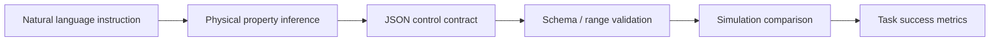
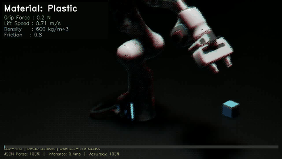

# LLM-First Robot Control

자연어 명령에서 물리 속성을 추론하고 로봇 제어 파라미터로 변환하는 LLM-first 로봇 제어 연구 프로젝트입니다.

> Portfolio position: robotics + LLM reasoning, structured control output, simulation-based validation.

## Why This Problem

로봇 제어는 보통 명시적인 파라미터와 규칙을 요구합니다. 하지만 실제 사용자는 “조심히 들어 올려”, “깨지기 쉬운 물체를 옮겨”처럼 자연어로 의도를 전달합니다. 이 프로젝트는 자연어 의도를 설명 텍스트로 끝내지 않고, `grip_force`, `lift_speed`, `safety_margin` 같은 검증 가능한 제어 파라미터로 바꾸는 문제를 다뤘습니다.

## Method



## What I Built

- DROID 공개 데이터 기반 instruction/control dataset 구성
- Qwen2.5-14B QLoRA fine-tuning 실험
- JSON schema 기반 제어 출력 구조화
- 물리 속성 추론 및 affordance 평가 모듈
- Genesis 기반 비교 실험과 Isaac Sim demo path
- 로봇 제어 파라미터를 `grip_force`, `lift_speed`, `density`, `friction` 등으로 매핑

## My Role

졸업논문 프로젝트로 데이터 구성, 모델 학습, 출력 schema 설계, 비교 실험, 시뮬레이션 검증을 주도했습니다. 핵심 목표는 “LLM 응답을 설명 텍스트가 아니라 검증 가능한 제어 파라미터”로 만드는 것이었습니다.

## Engineering Decisions

| Decision | Alternatives Considered | Why This Choice | Tradeoff |
| --- | --- | --- | --- |
| JSON control contract | free-form natural language answer | robot control에 필요한 필드/수치 범위를 검증 가능하게 만들기 위해 | 표현 자유도 감소 |
| QLoRA fine-tuning | prompt-only baseline, full fine-tuning | 제한된 자원에서 domain adaptation 실험 가능 | 모델 용량/데이터 품질에 민감 |
| Simulation-first validation | physical robot-only validation | 반복 실험과 실패 분석 비용을 줄이기 위해 | sim-to-real gap은 남음 |
| Physical property inference | direct action label prediction | 명령의 의미를 물체 속성과 affordance로 분해하기 위해 | property annotation/evaluation 설계 필요 |

## AI-Assisted Engineering Record

| Task | How AI Was Used | My Review / Rejection | Verification |
| --- | --- | --- | --- |
| Schema design | control output 후보 필드와 validation rule 후보를 생성하게 함 | 실제 제어에 설명 가능한 필드만 남기고 free-form field는 제외 | JSON parsing / required-field / numeric-range compliance |
| Evaluation planning | baseline 비교와 failure case 분류를 제안하게 함 | task success와 physical inference를 분리해 측정하도록 수정 | metric table below |
| Simulation scripts | Genesis/Isaac demo path의 구조와 edge case를 검토하게 함 | production robot claim으로 과장하지 않고 simulation validation으로 제한 | smoke/integration scripts |
| README synthesis | 논문식 설명을 portfolio evidence 구조로 압축하게 함 | AI가 만든 일반론은 제거하고 decision/tradeoff 중심으로 재작성 | README review |

## Stack

| Area | Stack |
| --- | --- |
| Language model | Qwen2.5-14B, QLoRA |
| Robotics data | DROID dataset, instruction dataset |
| Simulation | Genesis, Isaac Sim demo path |
| Implementation | Python, JSON schema, evaluation scripts |
| Output contract | Structured physical/control parameters |

## Run

```bash
# core module smoke/integration checks
python test_phase2_integration.py

# DROID analysis and conversion path
python droid_dataset_analyzer.py
python droid_to_genesis_pipeline.py
python integrated_droid_llm_pipeline.py
```

Isaac Sim demo path:

```bash
# Isaac Sim 5.1.0 설치 후
cd ~/IsaacSim/_build/linux-x86_64/release/
./python.sh /path/to/isaacSim/demo_portfolio.py
```

## Validation Evidence

| Metric | Result | What it checks |
| --- | ---: | --- |
| Proposed-method task success | 55.6% | whether structured control improves task completion in the tested setup |
| Physical inference accuracy | 66.7% | whether inferred object properties match expected physical reasoning |
| Safety margin | 1.6 | conservative control parameter buffer |
| JSON parsing compliance | 100% | output is machine-parseable |
| Required-field compliance | 100% | required control fields are present |
| Numeric-range compliance | 100% | generated values stay inside allowed ranges |

## Demo / Screenshots



## Known Limits

- Results are simulation/evaluation evidence, not a claim of production robot deployment.
- DROID-derived instruction/control mapping quality constrains model quality.
- The success rate is useful as a comparison signal, not a final robotics benchmark.
- Sim-to-real transfer remains future work.

## Notes

This README compresses the project into the evidence needed for portfolio review. Detailed experiments, scripts, and reports remain in the repository for deeper inspection.
