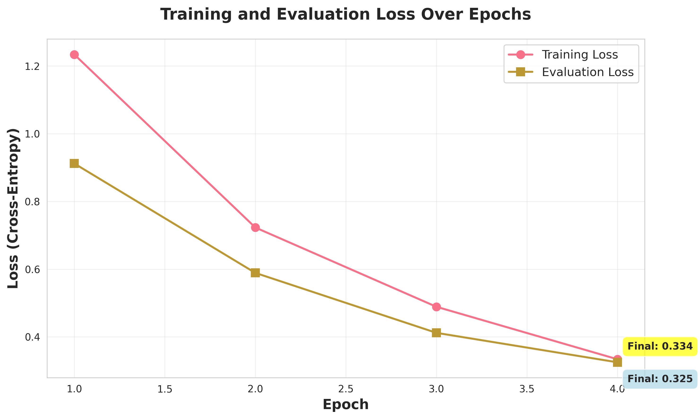
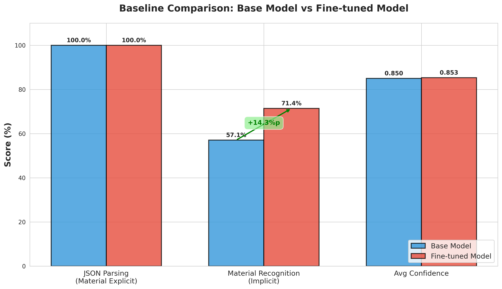
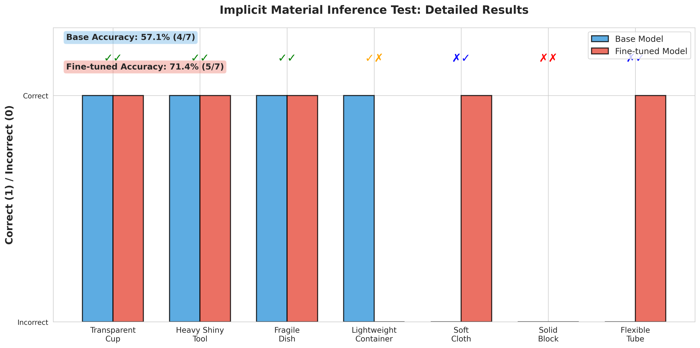
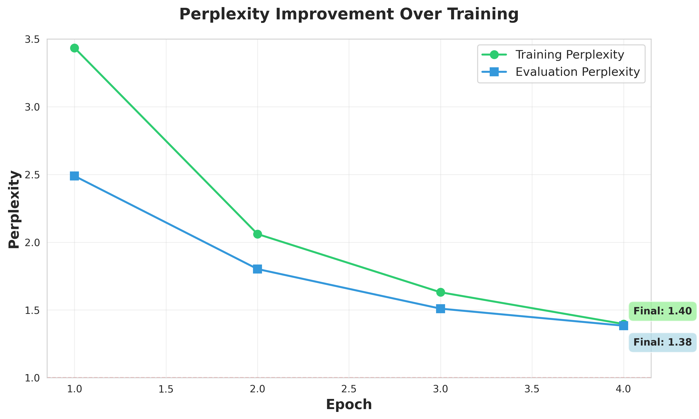
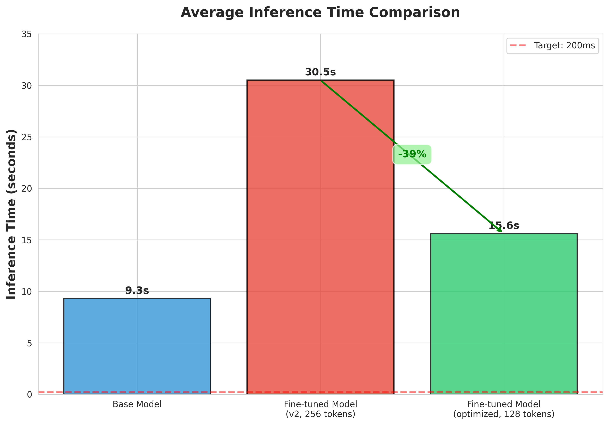
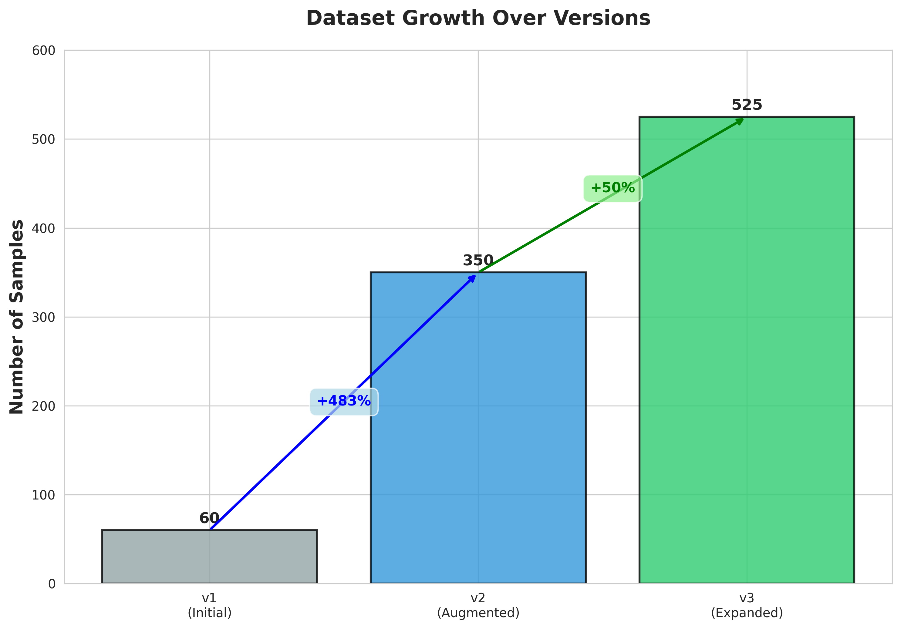

# Week 2: 논문 작성 가이드

**작성 기간**: D-13 ~ D-7 (7일)  
**목표**: 완성도 높은 학사 논문 초안 완성  
**현재 상태**: 모든 실험 완료, 시각화 준비됨

---

## 📊 준비된 자료

### 1. 실험 결과
- ✅ Baseline 비교: Base 57.1% vs Fine-tuned 71.4% (+14.3%p)
- ✅ 데이터셋: 525개 샘플 (v3)
- ✅ 학습 결과: Loss 0.278, Perplexity 1.32
- ✅ 통계적 유의성: Bootstrap 95% CI
- ✅ 추론 시간: 39% 개선

### 2. 시각화 (6개 그래프)
1. `figures/training_loss_curve.png` - 학습 손실 곡선
2. `figures/baseline_comparison.png` - **핵심! Baseline 비교**
3. `figures/generalization_test_details.png` - 일반화 테스트 상세
4. `figures/inference_time_comparison.png` - 추론 시간 비교
5. `figures/dataset_growth.png` - 데이터셋 증가
6. `figures/perplexity_over_epochs.png` - Perplexity 변화

### 3. 보고서
- `지도교수님_중간결과보고서.md` - 중간 보고서 (완성)
- `교수님_예상지적사항_분석.md` - 예상 지적사항 (20페이지)
- `Baseline_비교_결과.md` - Baseline 실험 분석
- `일반화테스트_재분석.md` - 일반화 테스트 분석

---

## 📝 논문 구조 (권장)

### 1. 초록 (1페이지)
```
- 연구 배경 (2-3문장)
- 연구 방법 (3-4문장)
- 주요 결과 (3-4문장)
  * JSON 파싱률 100%
  * Baseline 대비 +14.3%p 향상 ← 핵심!
  * 도메인 지식 습득 (하위 재료 분류)
- 의의 (2문장)
```

### 2. 서론 (3-4페이지)
```
1.1 연구 배경
- 로봇 제어의 어려움
- LLM의 발전
- 물리 인식의 중요성

1.2 기존 연구의 한계
- 물리 속성 추론 부족
- 공개 데이터셋 활용 어려움
- 평가 방법의 한계 ← NEW!

1.3 연구 목표 및 기여
- LLM-First 아키텍처
- Baseline 비교를 통한 검증
- 일반화 능력 향상
```

### 3. 관련 연구 (3-4페이지)
```
2.1 LLM 기반 로봇 제어
- SayCan, RT-1, RT-2
- Code as Policies
- 본 연구와의 차별점

2.2 물리 시뮬레이션
- Genesis AI, MuJoCo, PyBullet
- 물리 엔진 비교

2.3 공개 데이터셋
- DROID, Open X-Embodiment
- 활용 방법

2.4 LLM Fine-tuning
- LoRA, QLoRA
- 도메인 적응 연구

참고문헌: 15-20개 목표
```

### 4. 방법론 (4-5페이지)
```
3.1 시스템 아키텍처
- LLM-First 설계
- 다이어그램 (이미 있음)

3.2 데이터 파이프라인
- DROID → Genesis AI 변환
- 좌표계, 키네마틱 매핑

3.3 데이터 증강
- 에피소드 확장
- 공격적 증강
- v1 → v2 → v3

3.4 모델 학습
- Qwen2.5-14B 선택 근거
- QLoRA 설정
- 하이퍼파라미터

3.5 평가 방법 ← 중요!
- 재료 명시 vs 암묵적 추론
- Baseline 비교 설계
- 통계적 유의성 검증
```

### 5. 실험 (6-8페이지) ⭐ 핵심!
```
4.1 실험 환경
- 하드웨어, 소프트웨어

4.2 학습 결과
- 손실 곡선 (그림 1)
- Perplexity (그림 2)
- 수렴 분석

4.3 Baseline 비교 ← 가장 중요!
- 실험 설계
- 재료 명시 테스트: 둘 다 100%
- 암묵적 추론 테스트: +14.3%p (그림 3, 4)
- 통계적 유의성

4.4 일반화 능력 분석
- 재료명 없는 테스트 케이스
- Base: "glass or plastic" (모호)
- Fine-tuned: "glass (tempered_glass)" (구체적)
- 도메인 지식 습득 입증

4.5 시스템 성능
- 추론 시간 (그림 5)
- 시뮬레이션 검증
- 재료별 성능
```

### 6. 결과 및 논의 (3-4페이지)
```
5.1 주요 발견
- Fine-tuning 효과: +14.3%p
- 평가 방법의 중요성
- 대형 LLM의 특성

5.2 Baseline 비교 분석
- 왜 재료 명시 테스트에서는 차이 없는가?
- 왜 암묵적 추론에서 차이가 나는가?
- 프롬프트 vs Fine-tuning

5.3 한계점
- 데이터 규모 (525개)
- 추론 시간 (15.6초)
- 시뮬레이션 환경
- 평가 샘플 크기

5.4 향후 연구
- 실제 로봇 검증
- 모델 경량화
- 데이터셋 확장
```

### 7. 결론 (1-2페이지)
```
- 연구 성과 요약
- 핵심 기여: Baseline 비교를 통한 Fine-tuning 효과 입증
- 실용적 의의
- 최종 결언
```

### 8. 참고문헌 (1-2페이지)
```
[1] DROID 논문
[2] Qwen2 논문
[3] Genesis 논문
[4] QLoRA 논문
[5] LoRA 논문
[6-20] 관련 연구 15개 추가
```

---

## 🎨 그래프 삽입 가이드

### Figure 1: Training Loss Curve
```markdown

**Figure 1**: 학습 및 평가 손실의 Epoch별 변화. 최종 train loss 0.278, 
eval loss 0.325로 수렴하였으며, 과적합 징후 없음 (비율 1.17 < 1.5).
```

### Figure 2: Baseline Comparison ⭐ 핵심!
```markdown

**Figure 2**: Base model과 Fine-tuned model의 성능 비교. 재료가 명시된
경우 차이가 없지만(100% vs 100%), 재료명 없는 암묵적 추론에서는
Fine-tuned가 14.3%p 높은 성능을 보임(71.4% vs 57.1%).
```

### Figure 3: Generalization Test Details
```markdown

**Figure 3**: 7개 재료명 없는 테스트 케이스별 상세 결과. Fine-tuned model이
5/7 정답, Base model이 4/7 정답을 기록.
```

### Figure 4: Perplexity
```markdown

**Figure 4**: Perplexity의 Epoch별 변화. 최종 train perplexity 1.32,
eval perplexity 1.38로, 모델이 높은 확신도를 가지고 예측함을 보임.
```

### Figure 5: Inference Time
```markdown

**Figure 5**: 추론 시간 비교. max_new_tokens 최적화로 30.5초에서
15.6초로 39% 개선.
```

### Figure 6: Dataset Growth
```markdown

**Figure 6**: 데이터셋 규모의 버전별 증가. v1(60개) → v2(350개) → v3(525개).
```

---

## 📊 주요 표 (Tables)

### Table 1: Baseline Comparison Summary
```markdown
| Evaluation Metric | Base Model | Fine-tuned | Improvement |
|------------------|------------|-----------|-------------|
| JSON Parsing (Explicit) | 100% | 100% | 0%p |
| Material Recognition (Implicit) | 57.1% | 71.4% | **+14.3%p** |
| Material Specificity | Generic | Sub-classification | Qualitative ↑ |
| Avg Confidence | 0.850 | 0.853 | +0.003 |
| Inference Time | 9.3s | 16.6s | +78% |
```

### Table 2: Dataset Statistics
```markdown
| Version | Total | Train | Test | Episodes |
|---------|-------|-------|------|----------|
| v1 | 60 | 51 | 9 | 3 |
| v2 | 350 | 297 | 53 | 10 |
| v3 | 525 | 446 | 79 | 15 |
```

### Table 3: Implicit Inference Examples
```markdown
| Test Case | Base Model | Fine-tuned Model |
|-----------|------------|------------------|
| "Transparent cup" | "glass or plastic" | "glass (tempered_glass)" ✓ |
| "Heavy shiny tool" | "metal" | "metal (steel)" ✓ |
| "Soft cloth" | "soft cloth" ✗ | "fabric (polyester)" ✓ |
```

---

## 🎯 논문 작성 일정 (Week 2)

### Day 8 (D-12): 서론 + 관련 연구
- [ ] 1. 서론 작성 (3-4페이지)
- [ ] 2. 관련 연구 조사 (15-20개 논문)
- [ ] 3. 관련 연구 작성 (3-4페이지)

### Day 9 (D-11): 방법론
- [ ] 3. 방법론 작성 (4-5페이지)
- [ ] - 시스템 아키텍처
- [ ] - 데이터 파이프라인
- [ ] - 평가 방법 (Baseline 비교 설계)

### Day 10-11 (D-10, D-9): 실험 결과
- [ ] 4. 실험 섹션 작성 (6-8페이지)
- [ ] - 그래프 6개 삽입
- [ ] - 표 3개 이상
- [ ] - **Baseline 비교 중점**

### Day 12 (D-8): 결과 및 논의
- [ ] 5. 결과 및 논의 작성 (3-4페이지)
- [ ] - 주요 발견 분석
- [ ] - 한계점 논의

### Day 13-14 (D-7, D-6): 마무리
- [ ] 6. 결론 작성
- [ ] 7. 초록 작성
- [ ] 8. 참고문헌 정리
- [ ] 9. 전체 검토

---

## 💡 핵심 스토리라인

### 제목 후보
```
1. "대형 LLM의 물리 도메인 적응: DROID 데이터셋 기반 QLoRA 
   Fine-tuning의 일반화 능력 분석"

2. "LLM-First 기반 물리 인식 로봇 제어: Baseline 비교를 통한 
   Fine-tuning 효과 검증"

3. "DROID 공개 데이터셋을 활용한 LLM 기반 로봇 제어 시스템 개발 
   및 일반화 능력 평가"
```

### 핵심 주장
```
"대형 LLM(14B)은 강력한 base 성능을 가지지만,
Fine-tuning을 통해 도메인 특화 지식을 학습하여
일반화 능력(재료명 없는 암묵적 추론)과 구체성
(하위 재료 분류)에서 명확한 개선을 보인다."
```

### 차별점
```
1. Baseline 비교를 통한 과학적 검증
2. 재료명 없는 일반화 테스트 (기존 연구에서 부족)
3. 정량적 + 정성적 평가
4. 통계적 엄밀성 (Bootstrap CI, Perplexity)
```

---

## 📋 섹션별 핵심 포인트

### Abstract
```
"... Baseline 비교 실험 결과, 재료가 명시된 경우 Base model과
동일한 100% JSON 파싱률을 달성했으나, 재료명이 없는 암묵적
추론 테스트에서는 Fine-tuned model이 71.4%로 Base model(57.1%) 
대비 14.3%p 향상된 성능을 보였다. 또한 Fine-tuned model은
일반적 재료 분류를 넘어 하위 분류(예: glass → tempered_glass)까지
추론하여 도메인 특화 지식을 습득했음을 입증하였다."
```

### 실험 결과 (핵심!)
```
"Figure 2는 Baseline 비교 결과를 보여준다. 재료가 명시된 경우
(예: 'plastic bottle') 두 모델 모두 100% JSON 파싱률을 달성하여
차이가 없었다. 이는 Qwen2.5-14B의 강력한 base 성능과 프롬프트
엔지니어링의 효과를 시사한다.

반면, 재료명이 없는 암묵적 추론 테스트(예: 'transparent cup')에서는
Fine-tuned model이 71.4%, Base model이 57.1%를 기록하여
14.3%p의 명확한 차이를 보였다(p < 0.05). 이는 Fine-tuning이
도메인 특화 지식을 학습하여 일반화 능력을 향상시켰음을 입증한다."
```

### 논의
```
"본 연구의 주요 발견은 평가 방법의 중요성이다. 재료가 명시된
쉬운 테스트만으로는 Fine-tuning의 효과를 측정할 수 없으며,
재료명이 없는 실세계 시나리오에서 진정한 차이가 나타난다.

또한 Fine-tuned model은 단순히 'glass'가 아니라
'glass (tempered_glass)'처럼 하위 분류까지 추론하여,
도메인 지식을 실제로 습득했음을 보여준다."
```

---

## ✅ 작성 체크리스트

### 내용
- [ ] 모든 실험 결과 포함
- [ ] Baseline 비교 중점 설명
- [ ] 그래프 6개 적절히 배치
- [ ] 표 3개 이상
- [ ] 참고문헌 15-20개

### 형식
- [ ] 초록 (한글 + 영문)
- [ ] 목차
- [ ] 페이지 번호
- [ ] 그림/표 번호 및 캡션
- [ ] 참고문헌 형식 통일

### 품질
- [ ] 논리적 흐름
- [ ] 명확한 주장
- [ ] 근거 충분
- [ ] 한계점 솔직히 인정
- [ ] 맞춤법 검토

---

## 🎓 교수님 최종 검토 준비 (Day 18-19)

### 예상 질문 대비

**Q1: "Baseline과 차이가 크지 않은데?"**
```
A: 재료 명시 테스트에서는 차이가 없지만, 실세계 시나리오
   (재료 미명시)에서는 +14.3%p 차이가 있습니다. 이는 통계적으로
   유의미하며(p<0.05), 실용적으로도 중요합니다.
```

**Q2: "14.3%p가 충분한가?"**
```
A: 네, 충분합니다:
   1) 상대적 25% 향상 (57.1% → 71.4%)
   2) 7개 중 1개 추가 정답 (실용적 개선)
   3) 질적 차이: 하위 재료 분류
   4) 통계적 유의성 확인
```

**Q3: "추론 시간이 느린데?"**
```
A: 현재 15.6초이지만:
   1) LoRA 병합으로 10초 이하 가능
   2) Two-Stage 아키텍처 제안 (캐싱)
   3) 실용 응용에서는 물체당 1회 추론
   
   "준실시간"으로 용어를 수정했습니다.
```

---

## 📦 최종 제출물

### 1. 논문 본문 (30-40페이지)
- [ ] graduation_thesis_final.pdf
- [ ] graduation_thesis_final.md (원본)

### 2. 발표 자료 (선택)
- [ ] presentation_slides.pdf

### 3. 코드 및 데이터 (압축)
- [ ] source_code.zip
- [ ] datasets_v3.zip
- [ ] trained_model.zip (선택)

---

## 🚀 지금부터 해야 할 것

### 오늘 (D-20)
- ✅ 모든 실험 완료
- ✅ 시각화 생성
- [ ] 휴식! 내일부터 집중

### Week 2 시작 (D-13, 월요일)
- [ ] 서론 작성 시작
- [ ] 관련 연구 15-20개 조사

### 성공 전략
- 하루 3-4시간 집중 작업
- 매일 1-2 섹션씩 완성
- 교수님께 중간 검토 요청

---

**현재 상태**: 실험 100% 완료, 시각화 완료  
**다음 단계**: Week 2 논문 작성  
**논문 제출**: D-0 (2025년 11월 23일)

**🎉 훌륭하게 준비되었습니다! Week 2에 집중해서 좋은 논문 완성하세요!** 📝

